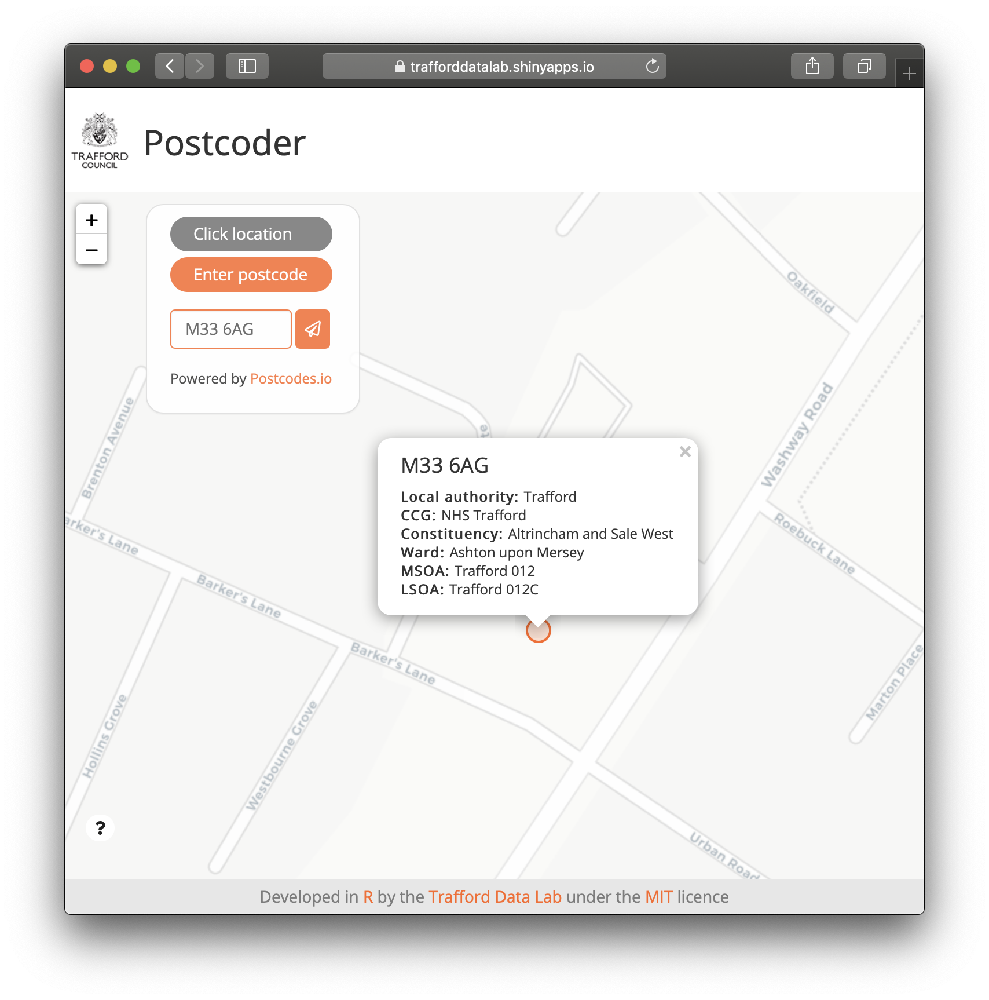

# Postcoder
An <a href="https://cran.r-project.org/" target="_blank">R</a> <a href="https://cran.r-project.org/web/packages/shiny/index.html" target="_blank">Shiny</a> app allowing users to find administrative and statistical geographies for a given postcode. The app is powered by open data provided by <a href="Postcodes.io" target="_blank">https://postcodes.io/</a>.

<br>



<br />

The app can be viewed at <a href="https://trafforddatalab.shinyapps.io/road_casualties/" target="_blank">https://trafforddatalab.shinyapps.io/postcoder</a>. To run the app locally execute the following code:

``` r
shiny::runGitHub("trafforddatalab/postcoder")
```
